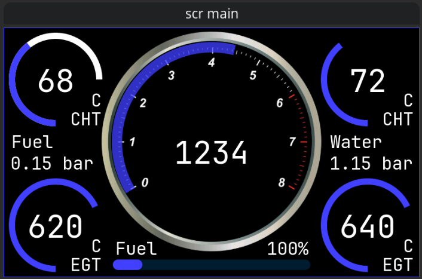

# Waveshare 4.3"

PlatformIO project initializing the touch panel and display for a Waveshare ESP32-S3 4.3" development kit under the ESP-IDF

To change things on the screen the Square line studio project is included. When you have changed things in Square line studio then make sure it exports to src/ui/ then recompile and send to display. This project was made in VSCode with PlatformIO.

## Code Overview

The main application logic lives in `src/main.cpp`.

- `app_main()` starts the system in this order: I2C, LCD, touch, UI, then ESP-NOW
- `lcd_initialize()` sets up the RGB display, LVGL, draw buffers, and the LVGL task
- `touch_initialize()` connects the GT911 touch controller to LVGL
- `setupEspNowReceiver()` starts the Wi-Fi and ESP-NOW receiver
- `onEspNowReceive()` stores the newest incoming sensor packet
- `updateUiFromEspNow()` copies sensor values into the dashboard widgets

In practice, the program works like this:

1. The hardware is initialized during startup
2. ESP-NOW packets arrive from external sensor senders
3. The latest packet is stored in shared memory
4. The LVGL task reads that packet and updates the screen

For a more detailed beginner-friendly explanation, see [docs/architecture.md](docs/architecture.md).
