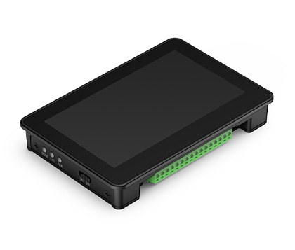
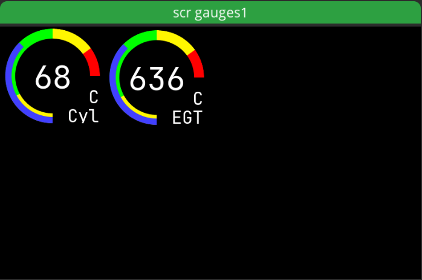

# Waveshare 4.3"

PlatformIO project initializing the touch panel and display for a Waveshare ESP32-S3 4.3" development kit under the ESP-IDF

To change things on the screen the Square line studio project is included. When you have changed things in Square line studio then make sure it exports to src/ui/ then recompile and send to display. This project was made in VSCode (1.129.1) with PlatformIO (3.3.4).
To help with the coding you can use VSCode together with GitHub Copilot for a few dollars.

## Code Overview

The main application logic lives in `src/main.cpp`.

- `app_main()` starts the system in this order: I2C, LCD, touch, UI, then ESP-NOW
- `lcd_initialize()` sets up the RGB display, LVGL, draw buffers, and the LVGL task
- `touch_initialize()` connects the GT911 touch controller to LVGL
